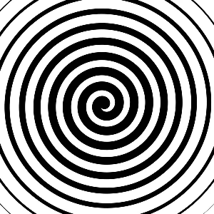
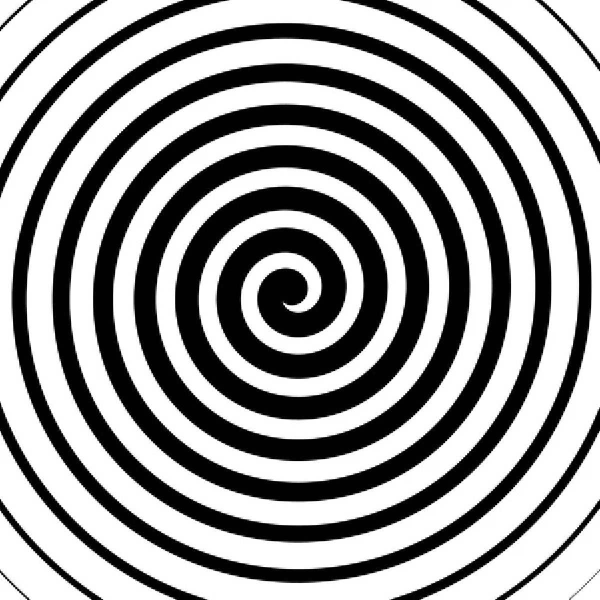

# Лабораторная работа №1. Передискретизация изображений

## Исходное изображение

## Задание 1:Растяжение изображения в M раз (M == 2)

## Задание 2: Сжатие изображения в N раз (N == 3)

 
## Задание 3: Передискретизация в К = М/N раз (M == 2, N == 3) через растяжение и последующее сжатие

