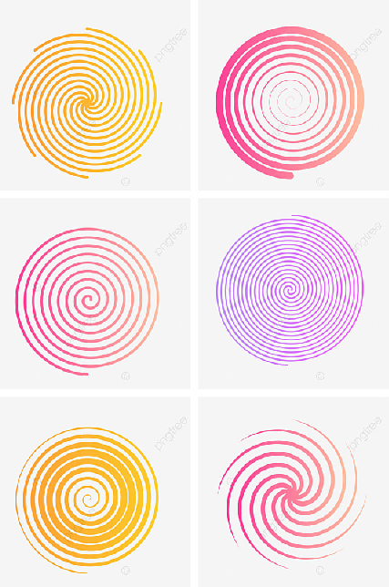
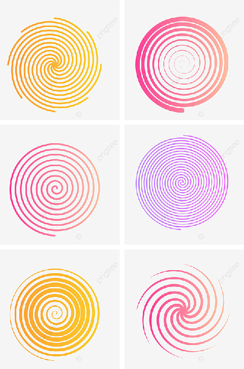

# Лабораторная работа №1. Передискретизация изображений

## Исходное изображение

## Задание 1:Растяжение изображения в M раз (M == 2)

## Задание 2: Сжатие изображения в N раз (N == 3)

 
## Задание 3: Передискретизация в К = М/N раз (M == 2, N == 3) через растяжение и последующее сжатие

## Задание 4: Передискретизация в К раз за один проход

## Выводы
На примере изображений со спиралями видно, что при любой передискретизации объекты, обладающие круглыми формами,
подвергаются пикселизации (рис. 1). Так же проявляется эффект Муара (особенно заметен при сжатии, рис. 2, 3).
При сравнении передискретизации в 1 (рис. 4) и 2 (рис. 3) прохода, можно утверждать, что при однопроходном преобразовании
изображение подвергается меньшей пикселизации.
