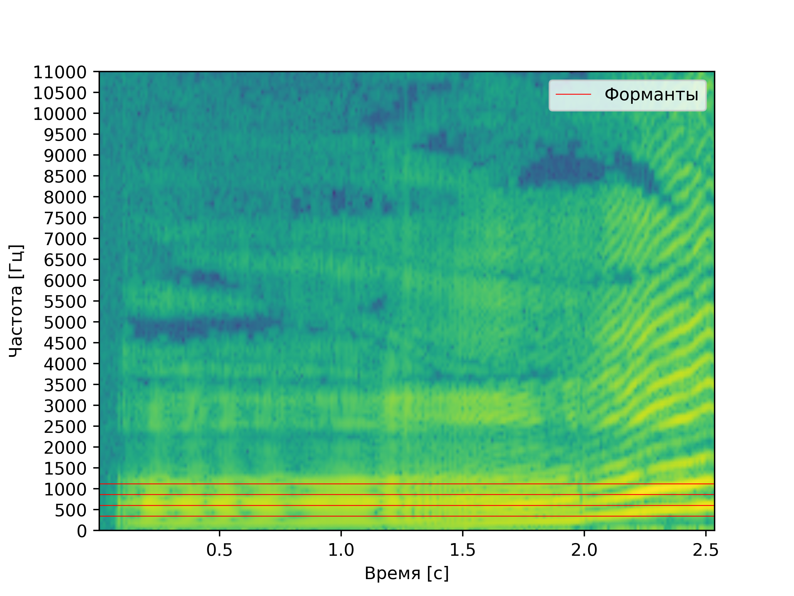
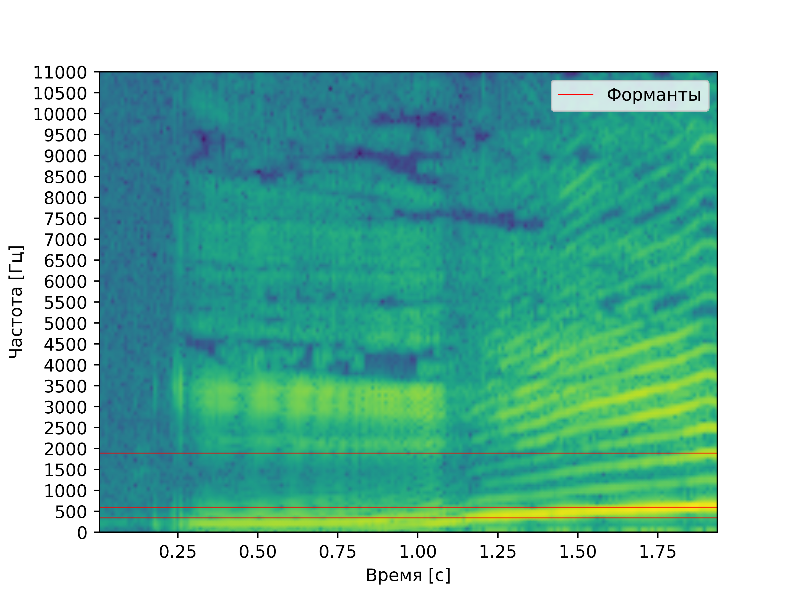
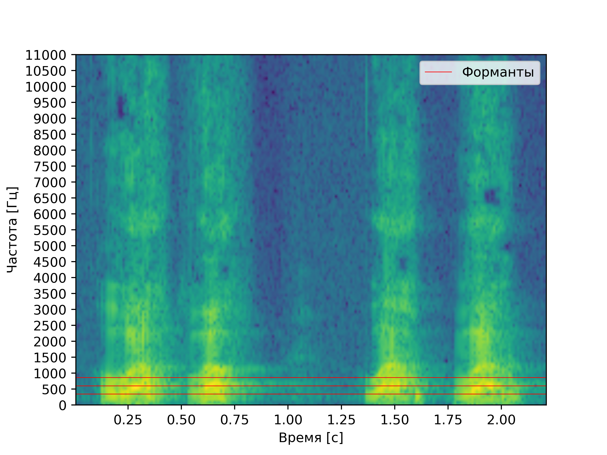

# Лабораторная работа №10. Обработка голоса
Лабораторная работа выполнялась для записи звуков "А" и "И" мужским голосом, а также для имитации собачьего лая.
Построены спектрограммы записи названных звуков и приведен их анализ: 
- Определение примерных минимальной и максимальной частот голоса
- Поиск основного тона
- Поиск самых сильных формант

## Спектрограмма записи звука "А" по наростающей

### Анализ
**Основной тон:** (если брать среднее ото всех зафиксированных частот) примерно XXX Гц

**Форманты:** форманта **FI** находится на частоте примерно XXX Гц, **FII** на частоте примерно XXX Гц,
**FIII** на частоте XXX Гц. После них идет провал,
и следующие неосновные две форманты появляются на частотах
приблизительно в XXX Гц и XXX Гц

## Спектрограмма записи звука "И" по наростающей

### Анализ
**Основной тон:** (если брать среднее ото всех зафиксированных частот) примерно XXX Гц

**Форманты:** основная форманта **FI** находится на частоте примерно XXX Гц, далее, после провала прослеживается **FII** на частоте примерно XXX Гц, еще выше  **FIII** на частоте XXX Гц. После можно различить
**FIV** на частоте XXX Гц.

## Спектрограмма записи лая

### Анализ
**Форманты:** в целом похожи на форманты буквы "А", но по частоте ниже: первая основная **FI** XXX Гц, вторая основная **FII** - XXX Гц, третья основная **FIII** - XXX Гц.
Так же просматривается еще одна неосновная на частоте XXX Гц.