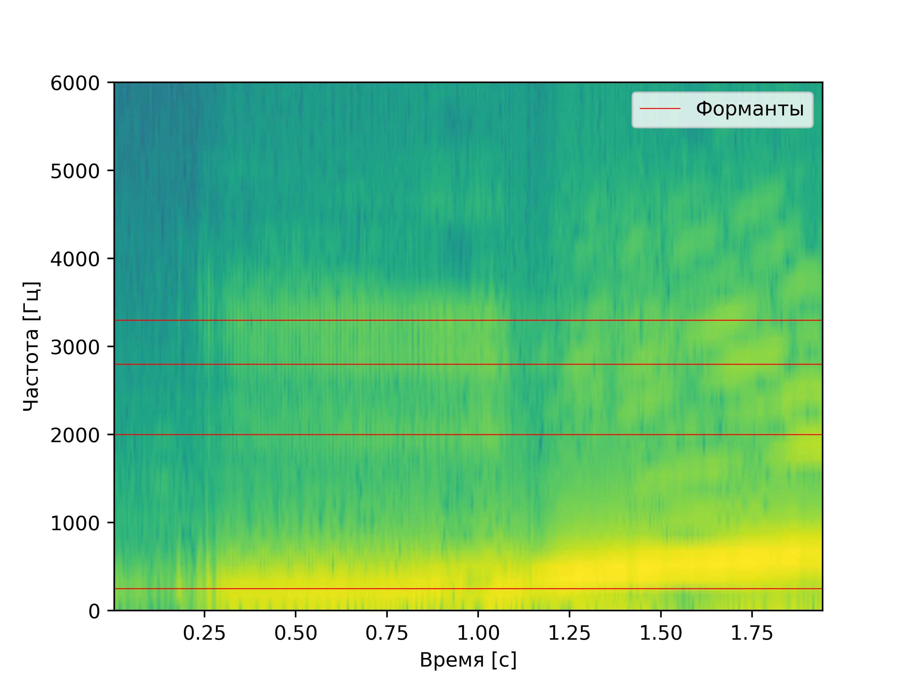
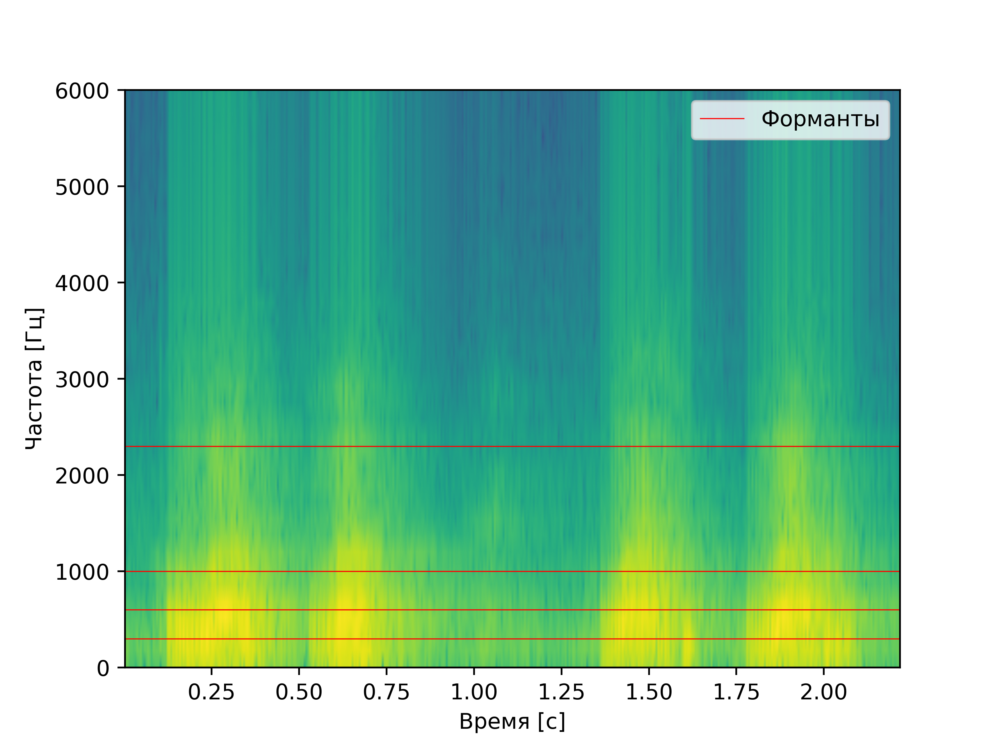

# Лабораторная работа №10. Обработка голоса
Лабораторная работа выполнялась для записи звуков "А" и "И" мужским голосом, а также для имитации собачьего лая.
Построены спектрограммы записи названных звуков и приведен их анализ: 
- Определение примерных минимальной и максимальной частот голоса
- Поиск основного тона
- Поиск самых сильных формант

## Спектрограмма записи звука "А" по наростающей

### Анализ
**Форманты:** форманта **FI** находится на частоте примерно 300 Гц, **FII** на частоте примерно 740 Гц,
**FIII** на частоте 1200 Гц. После них идет провал,
и следующие неосновные две форманты появляются на частотах
приблизительно в 2600 Гц и 3100 Гц

## Спектрограмма записи звука "И" по наростающей

### Анализ
**Основной тон:** 

**Форманты:** основная форманта **FI** находится на частоте примерно 250 Гц, далее, после провала прослеживается **FII** на частоте примерно 2000 Гц, еще выше  **FIII** на частоте 2800 Гц. После можно различить
**FIV** на частоте 3300 Гц.

## Спектрограмма записи лая

### Анализ
**Форманты:** в целом похожи на форманты буквы "А", но по частоте ниже: первая основная **FI** 300 Гц, вторая основная **FII** - 600 Гц, третья основная **FIII** - 1000 Гц.
Так же просматривается еще одна неосновная на частоте 2300 Гц.