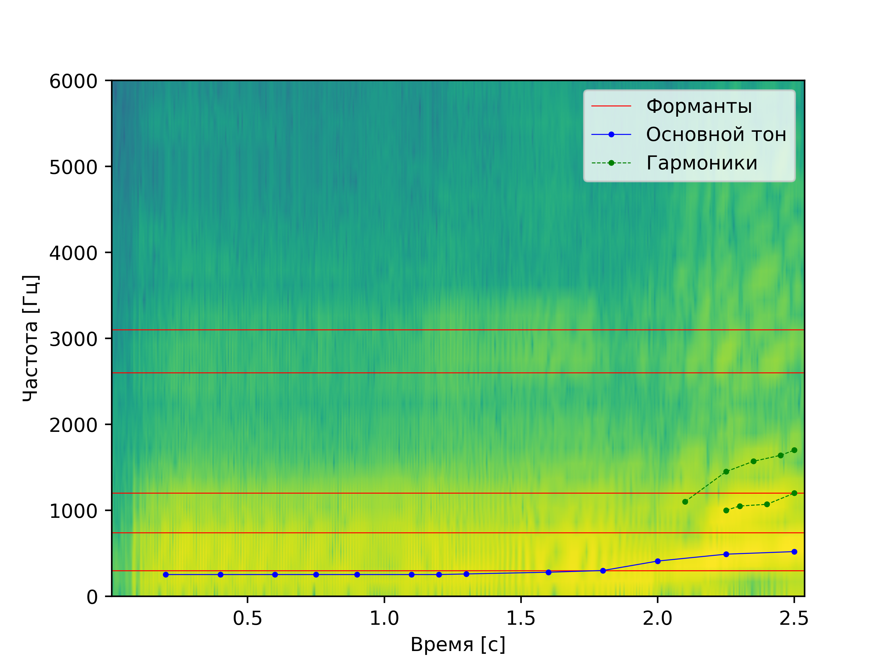

# Лабораторная работа №10. Обработка голоса
Лабораторная работа выполнялась для записи звуков "А" и "И" мужским голосом, а также для имитации собачьего лая.
Построены спектрограммы записи названных звуков и приведен их анализ: 
- Определение примерных минимальной и максимальной частот голоса
- Поиск основного тона
- Поиск самых сильных формант

## Спектрограмма записи звука "А" по наростающей

