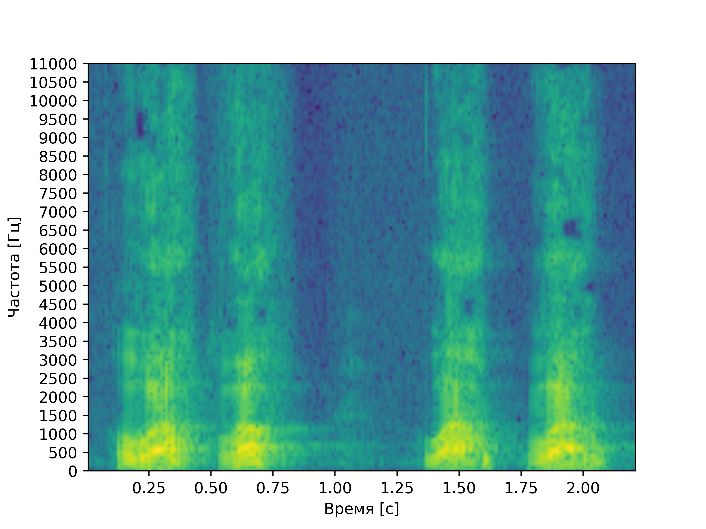

# Лабораторная работа №10. Обработка голоса
Лабораторная работа выполнялась для записи звуков "А" и "И" мужским голосом, а также для имитации собачьего лая.
Построены спектрограммы записи названных звуков и приведен их анализ: 
- Определение примерных минимальной и максимальной частот голоса
- Поиск основного тона
- Поиск самых сильных формант

## Спектрограмма записи звука "А" по наростающей

### Анализ
**Основной тон:** примерно 86 Гц

**Форманты:** форманта **FI** находится на частоте примерно 602 Гц, **FII** на частоте примерно 861 Гц,
**FIII** на частоте 1119 Гц.

**Максимальная частоста:** 3445 Гц

## Спектрограмма записи звука "И" по наростающей

### Анализ
**Основной тон:** примерно 86 Гц

**Форманты:** основная форманта **FI** находится на частоте примерно 344 Гц, далее, после провала прослеживается **FII** на частоте примерно 602 Гц, еще выше  **FIII** на частоте 1894 Гц.

**Максимальная частоста:** 4478 Гц

## Спектрограмма записи лая

### Анализ
**Форманты:** в целом похожи на форманты буквы "А", но по частоте ниже: первая основная **FI** 344 Гц, вторая основная **FII** - 602 Гц, третья основная **FIII** - 1119 Гц.

**Максимальная частоста:** 8354 Гц