# Лабораторная работа №2. Бинаризация изображений (Улучшенным алгоритмом Бернсена).
## Рандомная картинка ручной отрисовки
Оригинальное изображение:
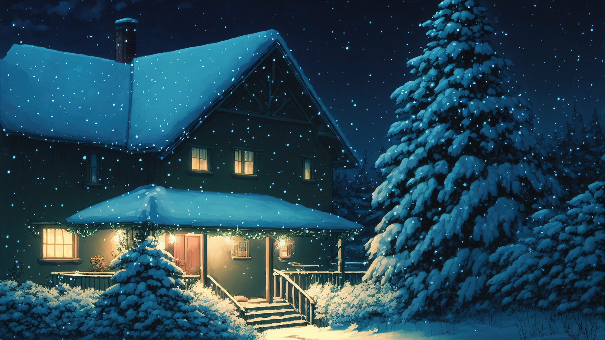

Полутоновое изображение:
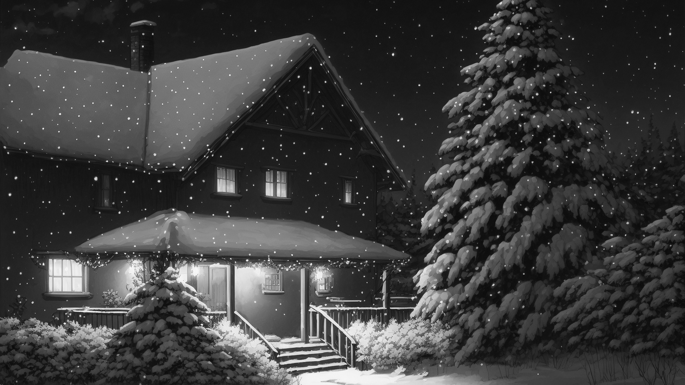

Бинаризованное изображение(Размер окна == 10, процент порога t == 15):

## Фотография шахматной доски
Оригинальное изображение:

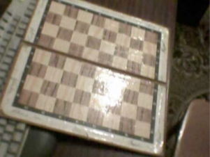

Полутоновое изображение:

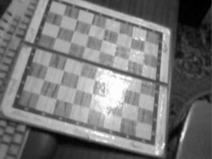

Бинаризованное изображение(Размер окна == 10, процент порога t == 17):

## Кадр из аниме
Оригинальное изображение:

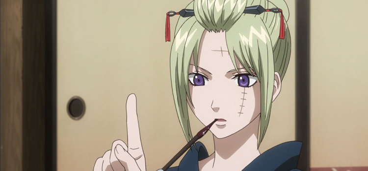

Полутоновое изображение:

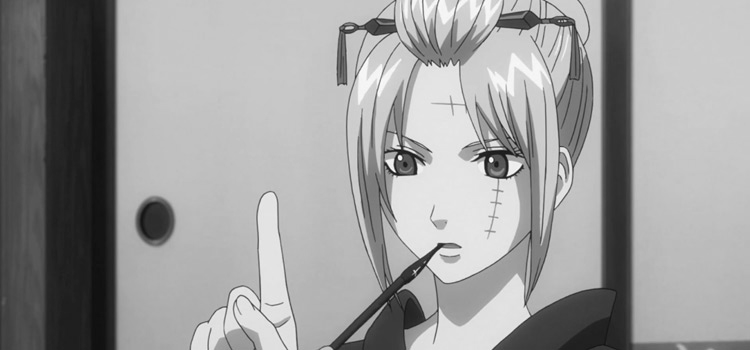

Бинаризованное изображение(Размер окна == 10, процент порога t == 15):
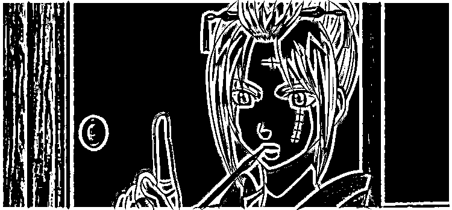

Бинаризованное изображение(Размер окна == 7, процент порога t == 14):
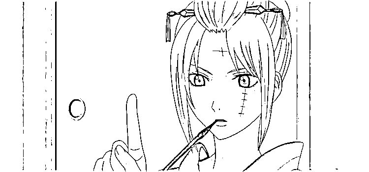

## Фотография человеческого лица
Оригинальное изображение:

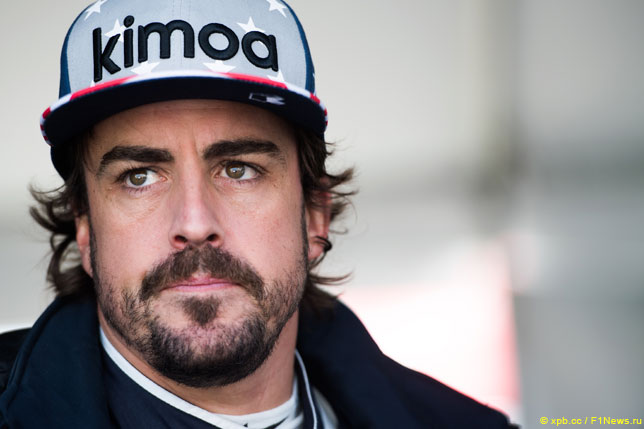

Полутоновое изображение:

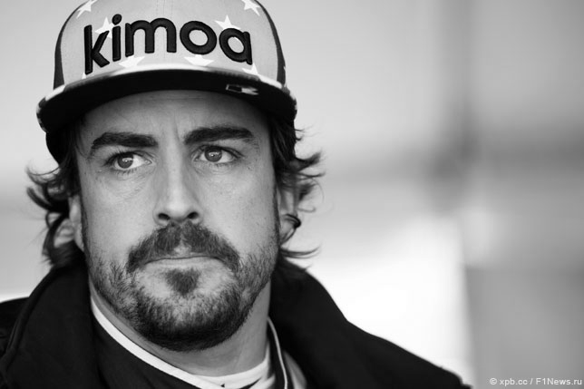

Бинаризованное изображение(Размер окна == 10, процент порога t == 15):

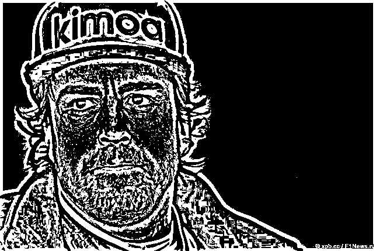

Бинаризованное изображение(Размер окна == 7, процент порога t == 17):

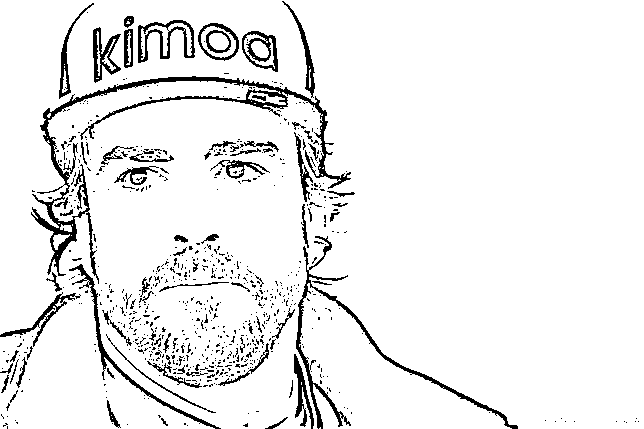