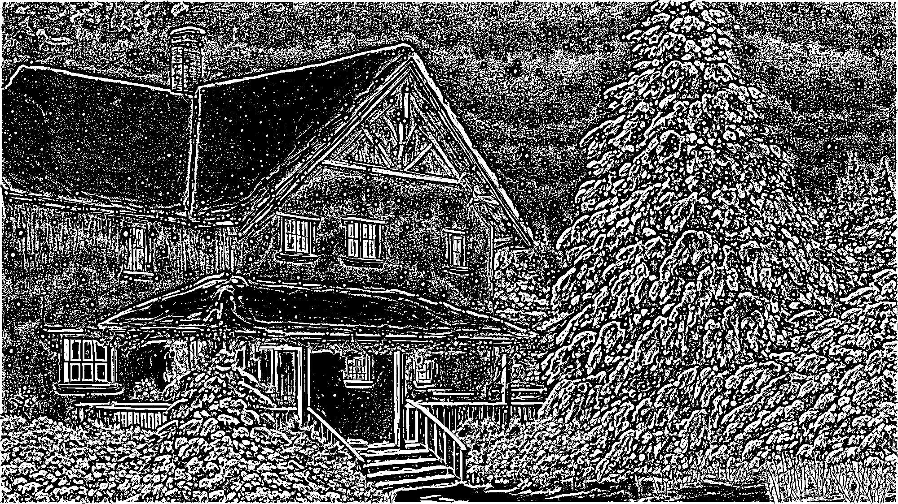

# Лабораторная работа №2. Бинаризация изображений (Улучшенным алгоритмом Бернсена).
## Рандомная картинка ручной отрисовки
Оригинальное изображение:

Полутоновое изображение:

Бинаризованное изображение(Размер окна == 10, процент порога t == 15):

## Фотография шахматной доски
Оригинальное изображение:

Полутоновое изображение:

Бинаризованное изображение(Размер окна == 10, процент порога t == 17):

## Кадр из аниме
Оригинальное изображение:

Полутоновое изображение:

Бинаризованное изображение(Размер окна == 10, процент порога t == 15):

Бинаризованное изображение(Размер окна == 7, процент порога t == 14):

## Фотография человеческого лица
Оригинальное изображение:

Полутоновое изображение:

Бинаризованное изображение(Размер окна == 10, процент порога t == 15):

Бинаризованное изображение(Размер окна == 7, процент порога t == 17):

## Фотография неравномерно засвеченного разворота книги
Оригинальное изображение:

Полутоновое изображение:

Бинаризованное изображение(Размер окна == 10, процент порога t == 15):

Бинаризованное изображение(Размер окна == 10, процент порога t == 20):

## Выводы
Бинаризация улучшенным методом Бернсена сильно зависит от размера окна и порогового значения t (см. кадр из аниме, фото лица и текст).
Исходя этих же изображений можно сказать, что данным методом плохо обрабатываются однородные области и он может порождать в них ложные
белые/черные пятна (как на изображении с шахматами). Плохо поддаются бинаризации изображения с текстом (внутри букв, да и в целом на всем изображении появляются шумы типов как
соли, так и перца). Края изображения так же обрабатываются плохо (особенно заметно на изображениях с преобладающим черным фоном).
Достаточно хорошо справляется с обработкой мультяшных персонажей.
