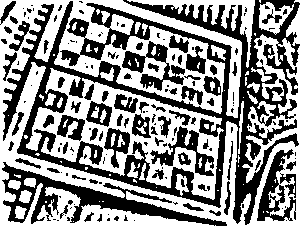

# Лабораторная работа №2. Бинаризация изображений (Улучшенным алгоритмом Бернсена).
## Рандомная картинка ручной отрисовки
Оригинальное изображение:

Полутоновое изображение:

Бинаризованное изображение(Размер окна == 10, процент порога t == 15):

## Фотография шахматной доски
Оригинальное изображение:

Полутоновое изображение:

Бинаризованное изображение(Размер окна == 10, процент порога t == 17):
