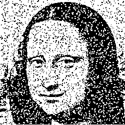
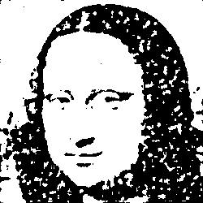
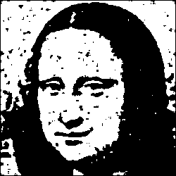
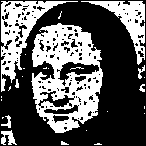
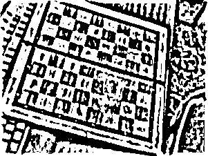
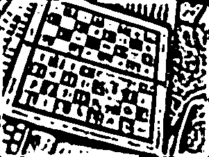
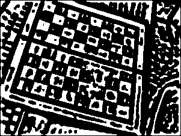
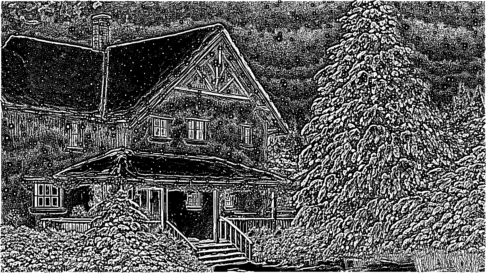
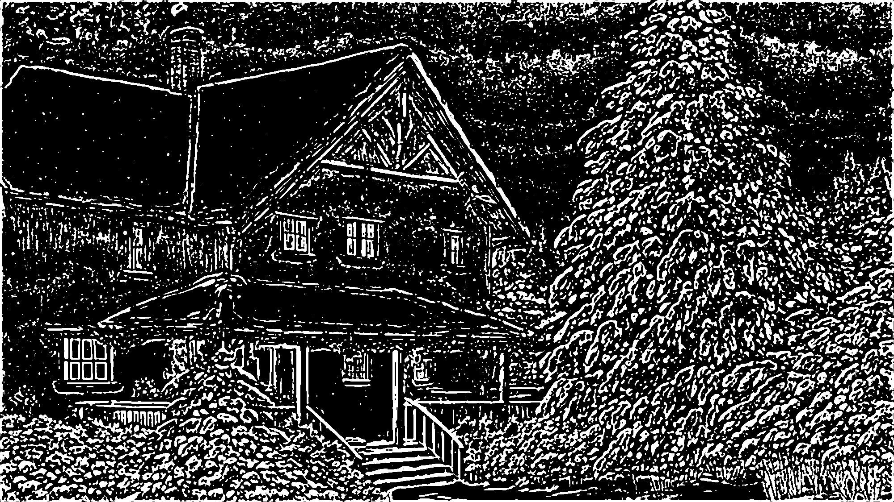

# Лабораторная работа №3. Фильтрация бинарных изображений. (Ранговым методом)

## Бинарное изображение Джоконты
Исходное изображение:

Фильрация(Размер окна w == 5, ранг r == 10/25)

Фильрация(Размер окна w == 5, ранг r == 15/25)

Фильрация(Размер окна w == 5, ранг r == 17/25)

Фильрация(Размер окна w == 5, ранг r == 20/25)

## Бинарное изобаржение шахматной доски:
Исходное изображение:

Фильтрация(Размер окна w == 5, ранг r == 15/25)

Фильтрация(Размер окна w == 5, ранг r == 20/25)

## Бинаризованное изображение ручного рисунка
Исходное изображение:

Фильтрация(Размер окна w == 5, ранг r == 17/25)

## Бинаризованное фото текста
Исходное изображение: 

Фильрация(Размер окна w == 7, ранг r == 20/49)
