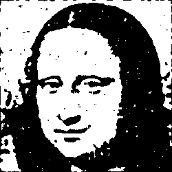

# Лабораторная работа №3. Фильтрация бинарных изображений. (Ранговым методом)

## Бинарное изображение Джоконты
Исходное изображение:

Фильрация(Размер окна w == 5, ранг r == 10/25)

Фильрация(Размер окна w == 5, ранг r == 15/25)

Фильрация(Размер окна w == 5, ранг r == 17/25)

Фильрация(Размер окна w == 5, ранг r == 20/25)

## Бинарное изобаржение шахматной доски:
Исходное изображение:

Фильтрация(Размер окна w == 5, ранг r == 15/25)

Фильтрация(Размер окна w == 5, ранг r == 20/25)

## Бинаризованное изображение ручного рисунка
Исходное изображение:

Фильтрация(Размер окна w == 5, ранг r == 17/25)

## Бинаризованное фото текста
Исходное изображение: 

Фильрация(Размер окна w == 7, ранг r == 20/49)

## Выводы
В зависимости от харктера изображения, ему подходит разный ранг. Обычно лучшие результаты показывает ранг, либо равный, либо чуть больше половины о  площади
окна (см изображения Джоконты и шахмат). В целом, фильтр неплохо справляется с "крупным" шумом, не очень хорошо справляется с "мелким" шумом. При маленьких значениях происходит высветление исходного изображения, потеря яркости и деталей вместе с шумом. При больших значениях фильтр начинает создавать дополнительные шумовые вставки, лишь ухудшая исходное изображение.
