# Лабораторная работа №4. Выделение контуров в изображениях.
## Рисунок ручной отрисовки
Исходное изображение:
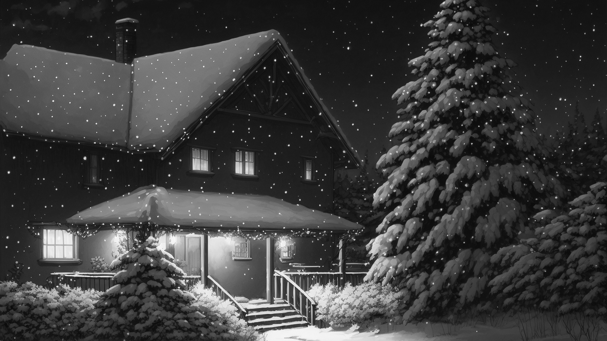

Градиент по Х:
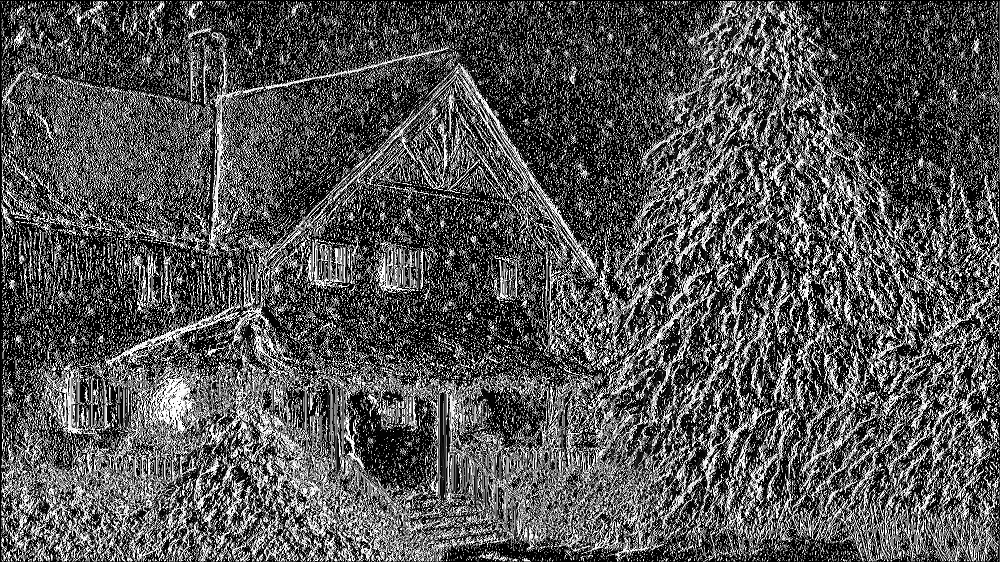

Градиент по Y:
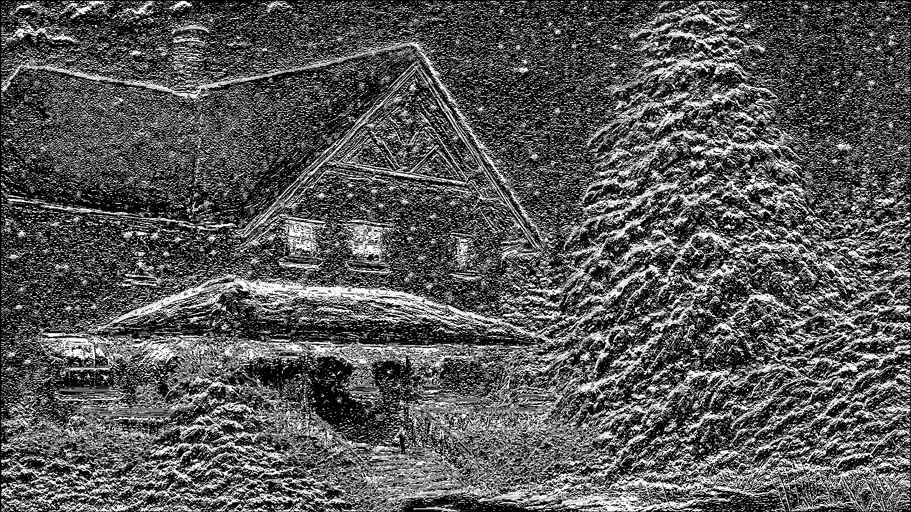

Градиентная матрица G:
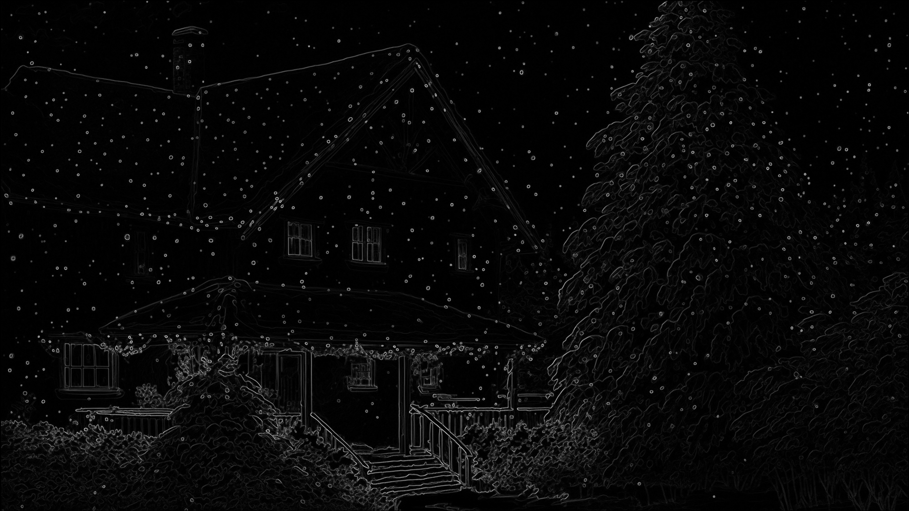

Бинаризованная градиентная матрица G(Бернсен):
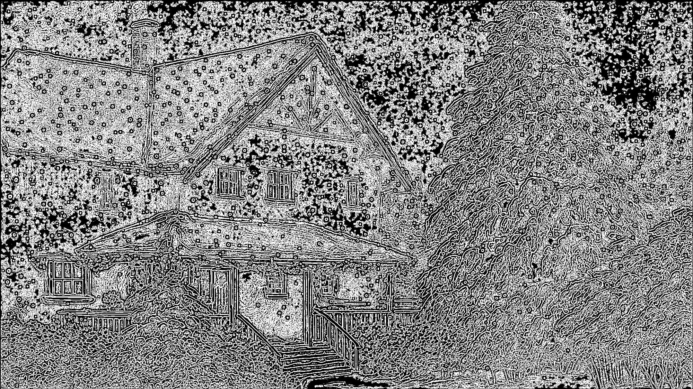

Бинаризованная градиентная матрица G(Глобальная бинаризация, порог 25):
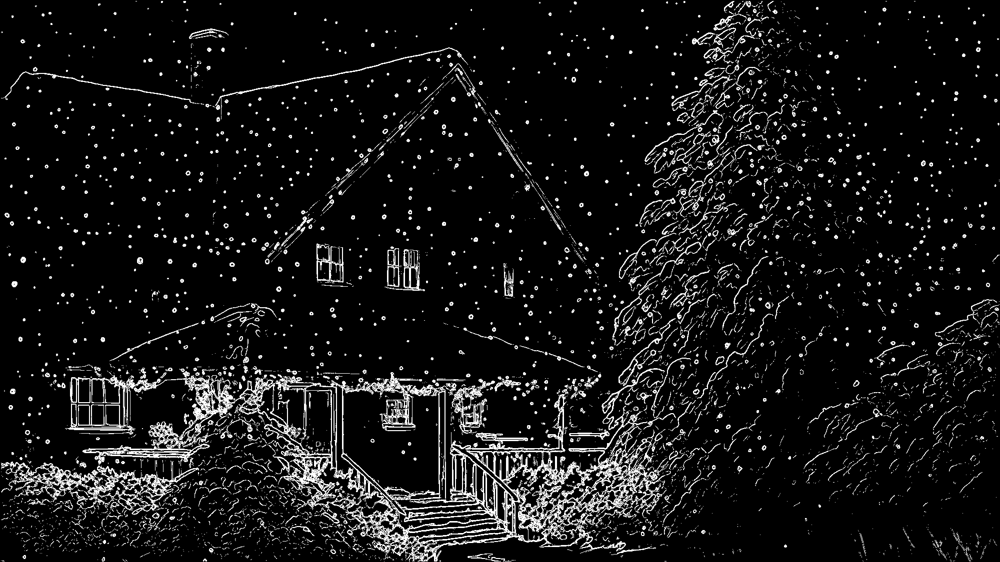

## Фото шахматной доски
Исходное изображение:

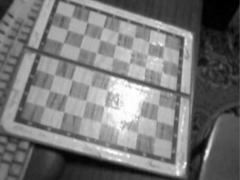

Градиент по Х:

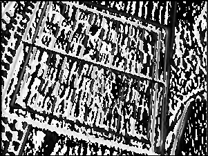

Градиент по Y:

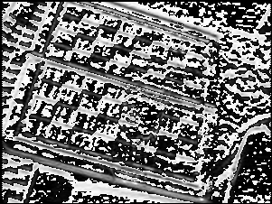

Градиентная матрица G:

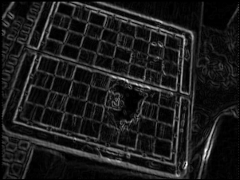

Бинаризованная градиентная матрица G(Бернсен):

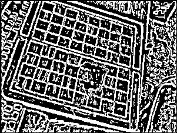

Бинаризованная градиентная матрица G(Глобальная бинаризация, порог 40):

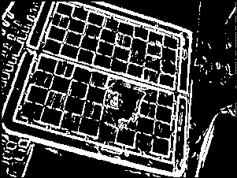

## Фото человеческого лица
Исходное изображение:

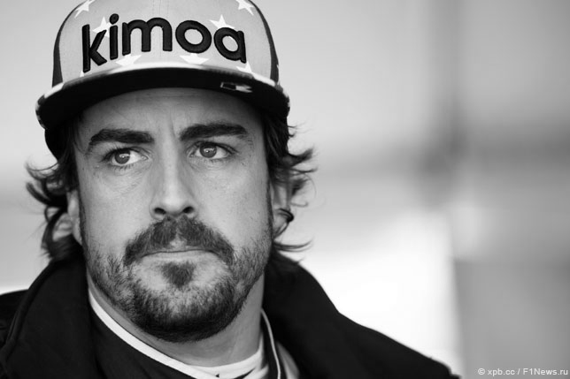

Градиент по Х:

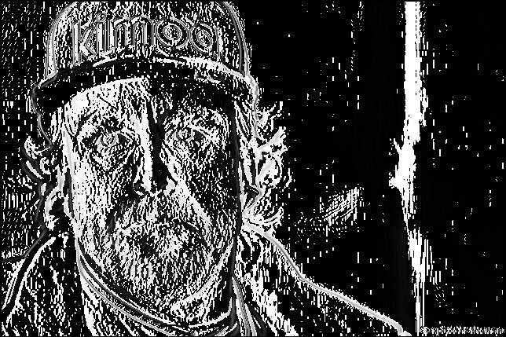

Градиент по Y:

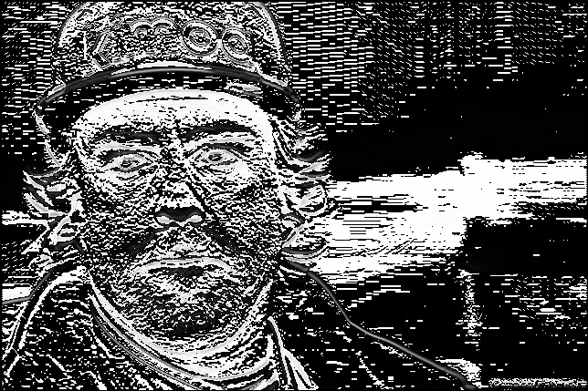

Градиентная матрица G:

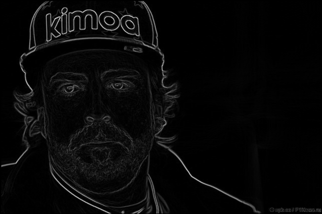

Бинаризованная градиентная матрица G(Бернсен):

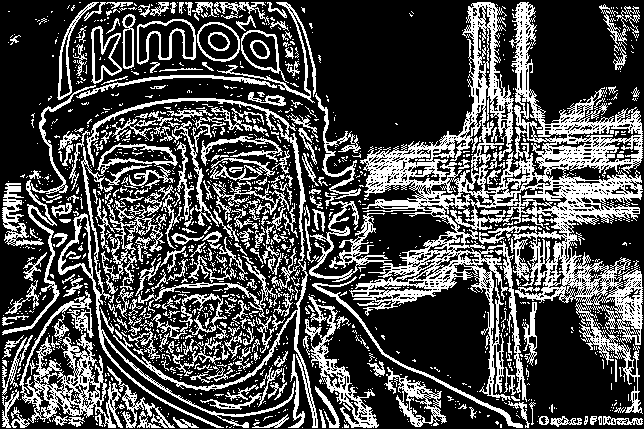

Бинаризованная градиентная матрица G(Глобальная бинаризация, порог 45):

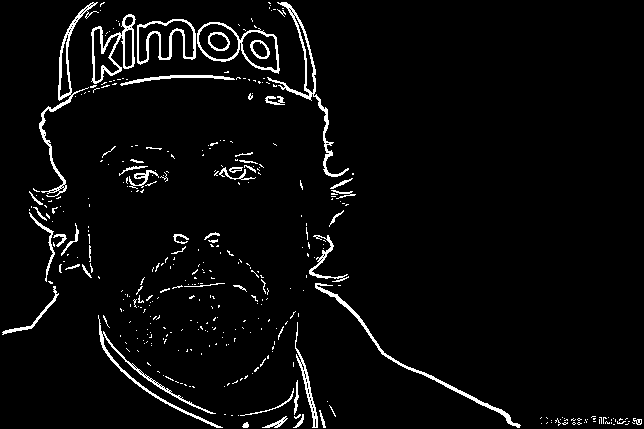

## Кадр из аниме
Исходное изображение:

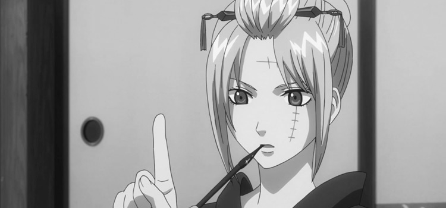

Градиент по Х:

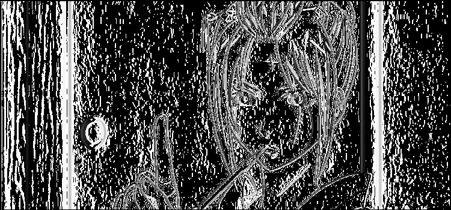

Градиент по Y:

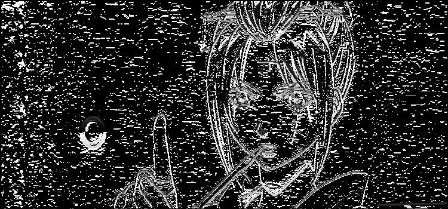

Градиентная матрица G:

Бинаризованная градиентная матрица G(Бернсен):

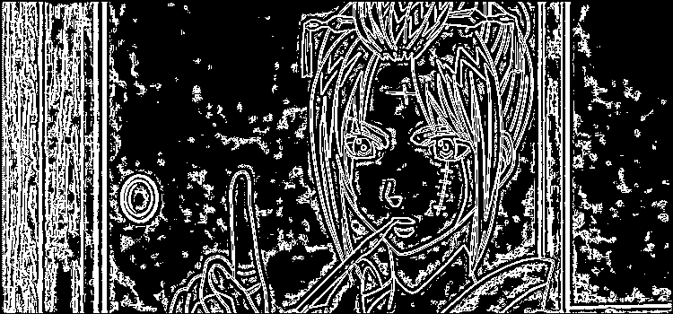

Бинаризованная градиентная матрица G(Глобальная бинаризация, порог 30):

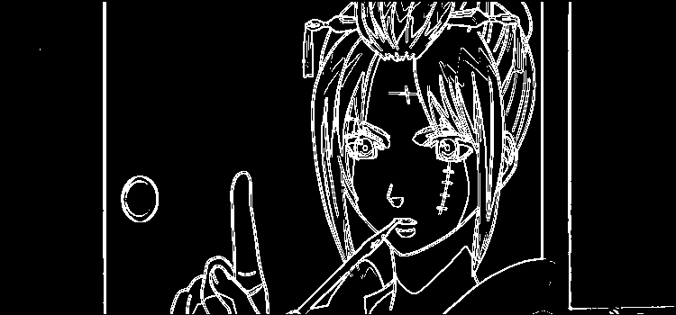

