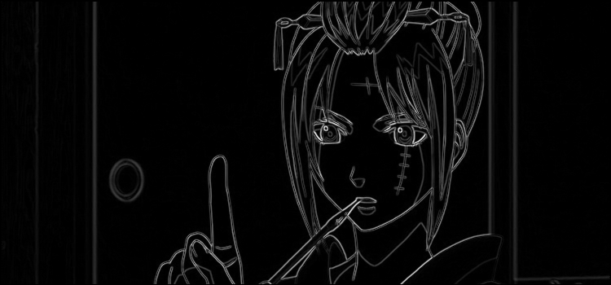

# Лабораторная работа №4. Выделение контуров в изображениях.
(Бинаризация проводилась методом бернсена, поэтому вместе с контурами много мусора)

## Рисунок ручной отрисовки
Исходное изображение:

Градиент по Х:

Градиент по Y:

Градиентная матрица G:

Бинаризованная градиентная матрица G:

## Фото шахматной доски
Исходное изображение:

Градиент по Х:

Градиент по Y:

Градиентная матрица G:

Бинаризованная градиентная матрица G:

## Фото человеческого лица
Исходное изображение:

Градиент по Х:

Градиент по Y:

Градиентная матрица G:

Бинаризованная градиентная матрица G:

## Кадр из аниме
Исходное изображение:

Градиент по Х:

Градиент по Y:

Градиентная матрица G:

Бинаризованная градиентная матрица G:

