# Лабораторная работа №5. Выделение признаков символов.
Лабораторная работа проделывалась на сомалийском письме Османия. Тип букв -- обычные прописные,
шрифт Times New Roman, размер 52. В качестве демонстрации были выбраны 
5 символов, представляющих собой наибольший интерес. Квадраты для рассчета веса черного расположены
следующим образом:

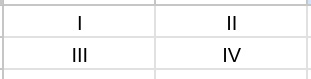

## Символ 𐒁 (ba)
Прямое и инвертированное сгенерированные изображения:

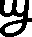

Профили буквы:

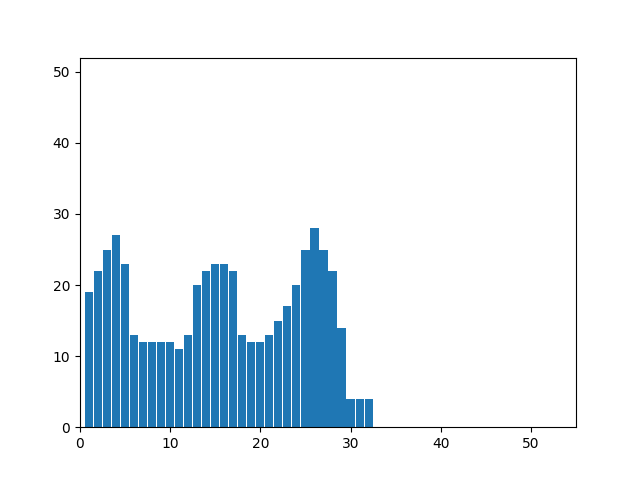
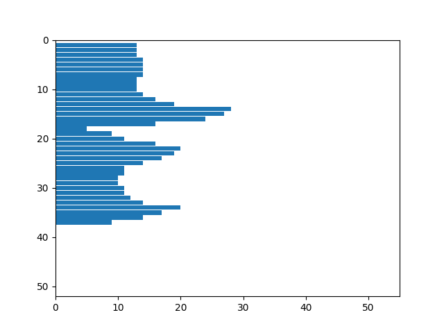

Признаки:
1. Вес первого квадрата: 161
2. Нормированный(на четверть площади) вес черного: 0.543918918918919
3. Вес второго квадрата: 122
4. Нормированный(на четверть площади) вес черного: 0.412162162162162
5. Вес третьего квадрата: 128
6. Нормированный(на четверть площади) вес черного: 0.432432432432432
7. Вес четвертого квадрата: 128
8. Нормированный(на четверть площади) вес черного: 0.432432432432432
9. Центр масс: (14.54, 17.58)
10. Нормированный центр масс: (0.44, 0.46)
11. Моменты инерции: (57228.90909090914, 43647.81076066787)
12. Нормированные моменты инерции: (0.196987168194069, 0.150239778744627)

## Символ 𐒆 (deel)
Прямое и инвертированное сгенерированные изображения:

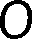

Профили буквы:

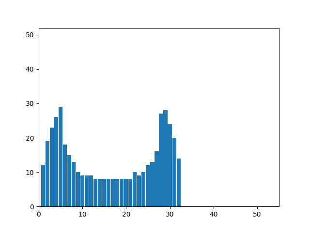
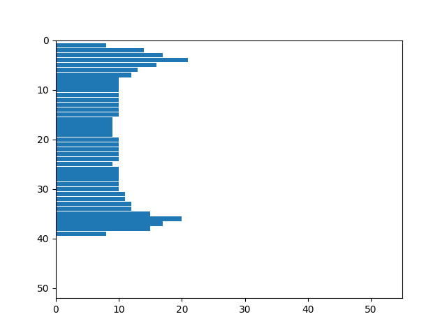

Признаки:
1. Вес первого квадрата: 103
2. Нормированный(на четверть площади) вес черного: 0.330128205128205
3. Вес второго квадрата: 114
4. Нормированный(на четверть площади) вес черного: 0.365384615384615
5. Вес третьего квадрата: 121
6. Нормированный(на четверть площади) вес черного: 0.387820512820513
7. Вес четвертого квадрата: 109
8. Нормированный(на четверть площади) вес черного: 0.349358974358974
9. Центр масс: (15.53020134228188, 19.002237136465325)
10. Нормированный центр масс: (0.468716172331674, 0.473743082538561)
11. Моменты инерции: (64634.99776286346, 50077.34228187924)
12. Нормированные моменты инерции: (0.323483915954053, 0.250626059296024)

## Символ 𐒎 (qaaf)
Прямое и инвертированное сгенерированные изображения:

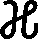
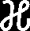

Профили буквы:

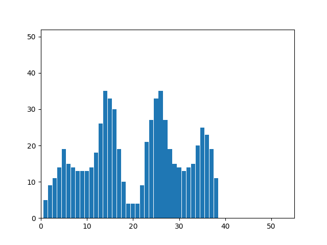
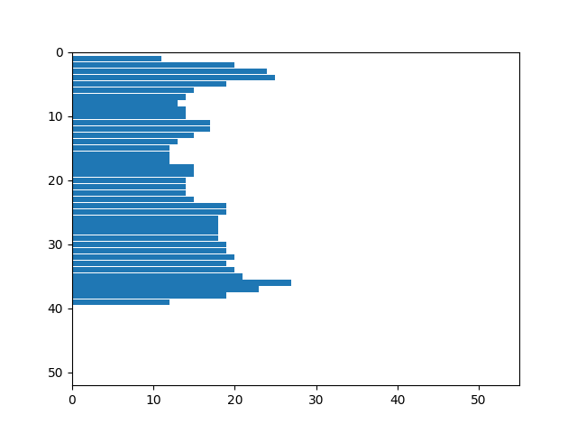

Признаки:
1. Вес первого квадрата: 121
2. Нормированный(на четверть площади) вес черного: 0.327027027027027
3. Вес второго квадрата: 176
4. Нормированный(на четверть площади) вес черного: 0.475675675675676
5. Вес третьего квадрата: 194
6. Нормированный(на четверть площади) вес черного: 0.524324324324324
7. Вес четвертого квадрата: 172
8. Нормированный(на четверть площади) вес черного: 0.464864864864865
9. Центр масс: (19.65158371040724, 19.764705882352942)
10. Нормированный центр масс: (0.504096857038034, 0.493808049535604)
11. Моменты инерции: (90395.29411764677, 70380.51583710405)
12. Нормированные моменты инерции: (0.20564528917564, 0.160112555337397)

## Символ 𐒕 (ya)
Прямое и инвертированное сгенерированные изображения:

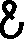

Профили буквы:

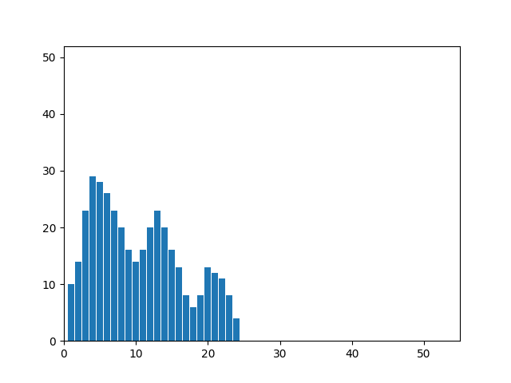
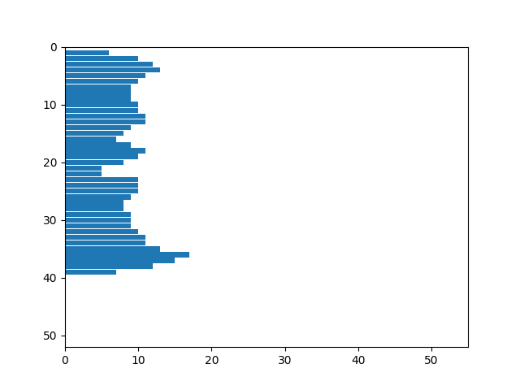

Признаки:
1. Вес первого квадрата: 128
2. Нормированный(на четверть площади) вес черного: 0.547008547008547
3. Вес второго квадрата: 57
4. Нормированный(на четверть площади) вес черного: 0.243589743589744
5. Вес третьего квадрата: 111
6. Нормированный(на четверть площади) вес черного: 0.474358974358974
7. Вес четвертого квадрата: 85
8. Нормированный(на четверть площади) вес черного: 0.363247863247863
9. Центр масс: (9.490813648293964, 19.514435695538058)
10. Нормированный центр масс: (0.36916581079539, 0.487221991987844)
11. Моменты инерции: (52219.17060367458, 14591.217847769049)
12. Нормированные моменты инерции: (0.359732783624214, 0.100517479541813)

## Символ 𐒝 (oo)
Прямое и инвертированное сгенерированные изображения:

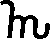

Профили буквы:

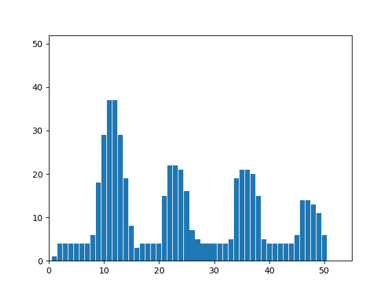
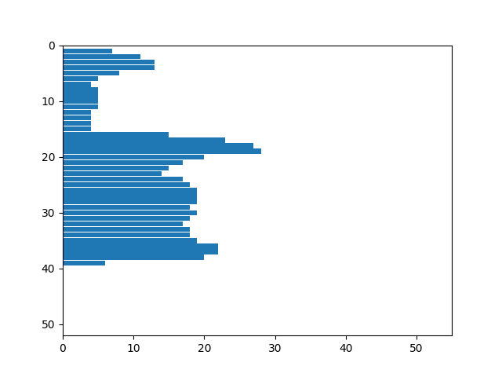

Признаки:
1. Вес первого квадрата: 153
2. Нормированный(на четверть площади) вес черного: 0.314168377823409
3. Вес второго квадрата: 37
4. Нормированный(на четверть площади) вес черного: 0.075975359342916
5. Вес третьего квадрата: 170
6. Нормированный(на четверть площади) вес черного: 0.349075975359343
7. Вес четвертого квадрата: 185
8. Нормированный(на четверть площади) вес черного: 0.379876796714579
9. Центр масс: (23.541284403669724, 22.38348623853211)
10. Нормированный центр масс: (0.46002621231979, 0.562723322066634)
11. Моменты инерции: (57122.85137614672, 97345.32110091703)
12. Нормированные моменты инерции: (0.192316644646568, 0.327734436835004)