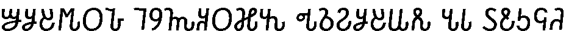
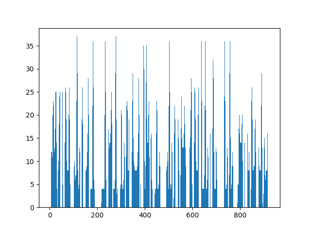

# Лабораторная работа №6. Сегментация текста
Лабораторная работа выполнялась для сомалийского алфавита Османья, прописные буквы, шрифт Times New Roman, кегль 52.

Из исходного изображения выделена область, содержащая текст. Затем данная область сегментирована на символы. Обе операции реализованы с использованием профилей.

## Исходное изображение:
В исходном виде:

В инвертированном виде:

## Профиль по оси X

## Профиль по оси Y

## Сегментация текста
В исходном виде:

В инвертированном виде:

## Сегментация символов
Выделенные символы с границами:

Выделенные символы в прямом и инвертированном виде сохранены в отдельные файлы для дальнейшей обработки.

## Выводы
Алгоритм сегментации символов работает хорошо, никаких проблем при сегментации текстовой области на основе профилей не возникает.
