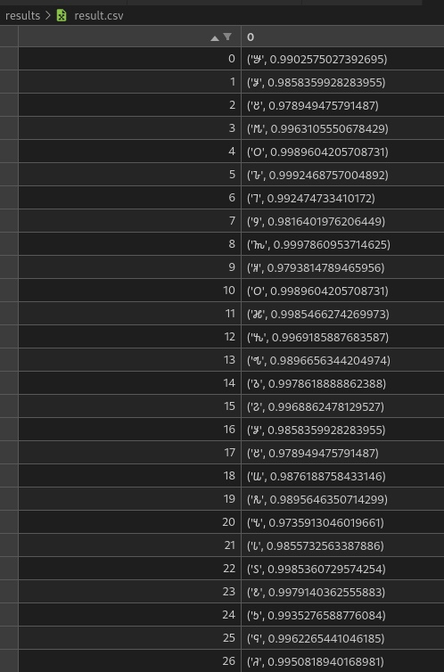
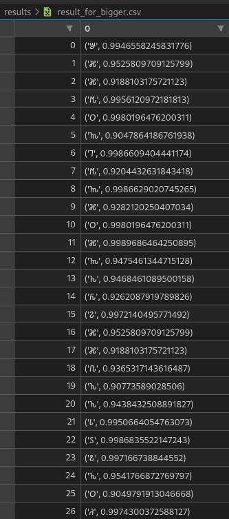

# Лабораторная работа №7. Классификация на основе признаков, анализ профилей.
Лабораторная работа выполнялась для сомалийского алфавита, тип букв - строчные, шрифт - Times New Roman размера 52.

## Распознавание строки того же размера
### Исходное изображение

### Классификация символов
Лучшие гипотезы имеют следующий вид:

Получается следующее предложение:
𐒁𐒋𐒔𐒄𐒆𐒊𐒇𐒘𐒝𐒏𐒆𐒎𐒓𐒂𐒈𐒒𐒋𐒔𐒜𐒌𐒍𐒗𐒖𐒕𐒑𐒛𐒚

\textbf{Анализ}
Классификация для того же размера шрифта работает хорошо, все буквы распознаются.

## Распознавание строки большего размера
### Исходное изображение

### Классификация символов
Лучшие гипотезы имеют вид:

Получается следующее предложение:
𐒁𐒎𐒎𐒄𐒆𐒝𐒇𐒄𐒝𐒎𐒆𐒎𐒝𐒙𐒅𐒒𐒎𐒎𐒐𐒙𐒙𐒗𐒖𐒕𐒙𐒆𐒚

\textbf{Анализ}
При значительном увеличении шрифта точность распознавания значительно снижается.
Происходит потеря распознавания схожих в своих глифах символов, например:

𐒋,𐒔,𐒏 -> 𐒎
𐒌,𐒑,𐒈 -> 𐒙
𐒓 -> 𐒝

Так что при большом увеличении классификация теряет актуальность.