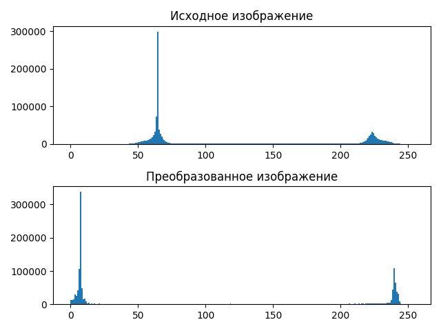

# Лабораторная работа №8. Текстурный анализ и контрастирование.
- Параметры матрицы Харалика: d = 2, $varphi$ = {0, 90, 180, 270}
- Расчет признаков CON и LUN
- Логарифмическое контрастирование
- Матрицы Харалика(логарифмической нормировки) для полутоновых и контрастированных изображений

##  Изображение кирпичной стены
### Исходное:

### Полутоновое:

### Матрица Халарика

### Признаки
CON: 3012096387.2523365

LUN: 77513.24652186273

### Гистограммы

### Констрастированное изображение

### Матрица Халарика для контрастированного изображения

### Контрастированные признаки
CON (contrasted): 10628404917.52531

LUN (contrasted): 40407.39082644542

##  Изображение узора с обоев
### Исходное:

### Полутоновое:

### Матрица Халарика

### Признаки
CON: 18512023137.52082

LUN: 39902.956713681466

### Гистограммы

### Констрастированное изображение

### Матрица Халарика для контрастированного изображения

### Контрастированные признаки
CON (contrasted): 1882853324.08779

LUN (contrasted): 15910.17468639537