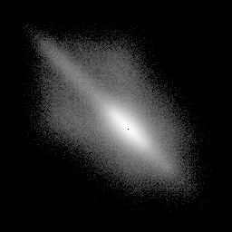
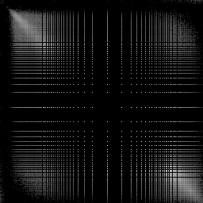
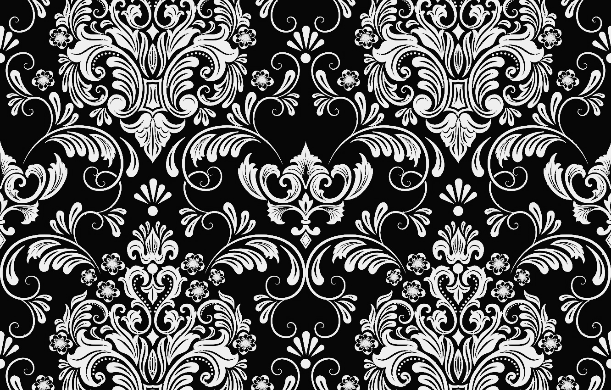
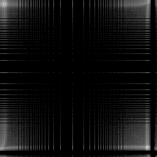
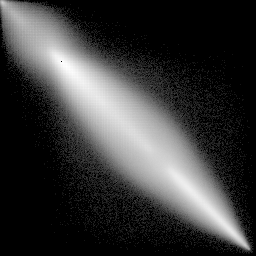
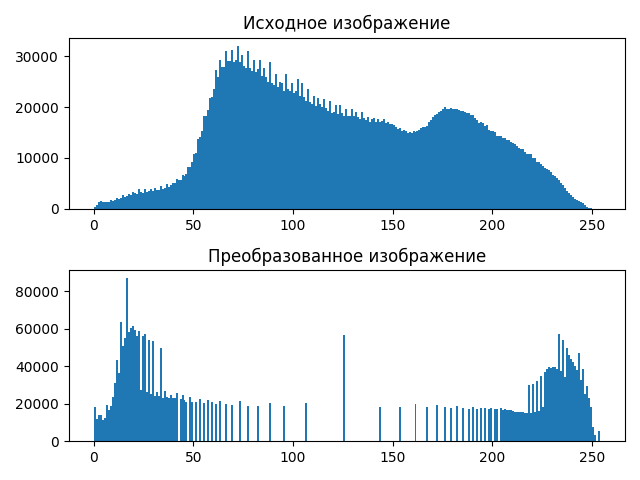
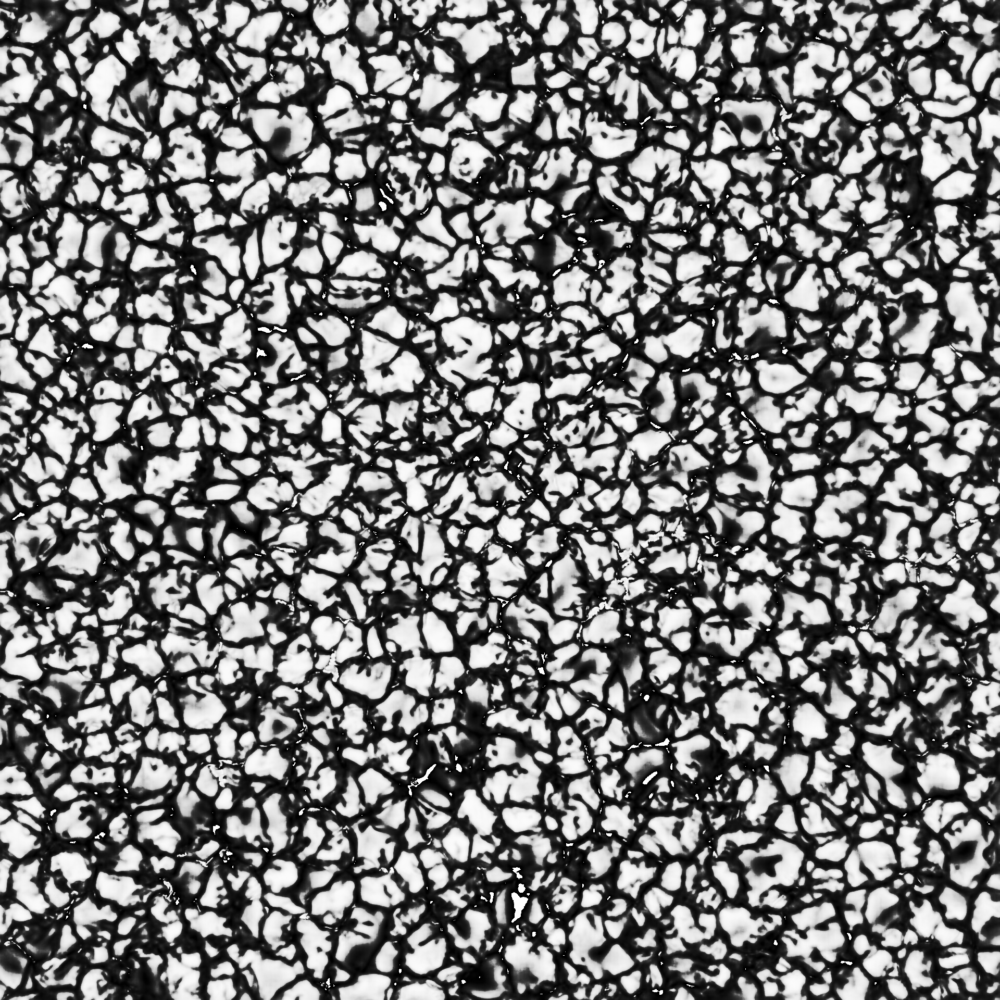

# Лабораторная работа №8. Текстурный анализ и контрастирование.
- Параметры матрицы Харалика: d = 2, $\phi$ = {0, 90, 180, 270}
- Расчет признаков CON и LUN
- Логарифмическое контрастирование
- Матрицы Харалика(логарифмической нормировки) для полутоновых и контрастированных изображений

##  Изображение кирпичной стены (L = 7)
### Исходное:

### Полутоновое:

### Матрица Харалика

### Признаки
CON: 105576465.92242281

LUN: 22444.24735257008

### Гистограммы

### Констрастированное изображение

### Матрица Харалика для контрастированного изображения

### Контрастированные признаки
CON (contrasted): 113983514.39752823

LUN (contrasted): 2160.9824011652677

##  Изображение узора с обоев
### Исходное:

### Полутоновое:

### Матрица Харалика

### Признаки
CON: 3981144.1149413614

LUN: 498.51908649458375

### Гистограммы

### Констрастированное изображение (L = 7)

### Матрица Харалика для контрастированного изображения

### Контрастированные признаки
CON (contrasted): 8137120.671267983

LUN (contrasted): 408.7027770180322
##  Изображение поверхности Солнца
### Исходное:

### Полутоновое:

### Матрица Харалика

### Признаки
CON: 97768871.89628883

LUN: 64092.08477542071

### Гистограммы

### Констрастированное изображение (L = 7)

### Матрица Харалика для контрастированного изображения

### Контрастированные признаки
CON (contrasted): 118477364.31172077

LUN (contrasted): 13870.39446402004

## Выводы
Логарифмическое контрастирование обычно уменьшает яркость изображения в целом, а так же иногда может помочь выделить текстуры объектов, несильно отличающихся по яркости. Матрица Харалика при этом меняется; параметр CON (контрастность), как правило, увеличивается, а параметр LUN (линейная однородность) уменьшается.
